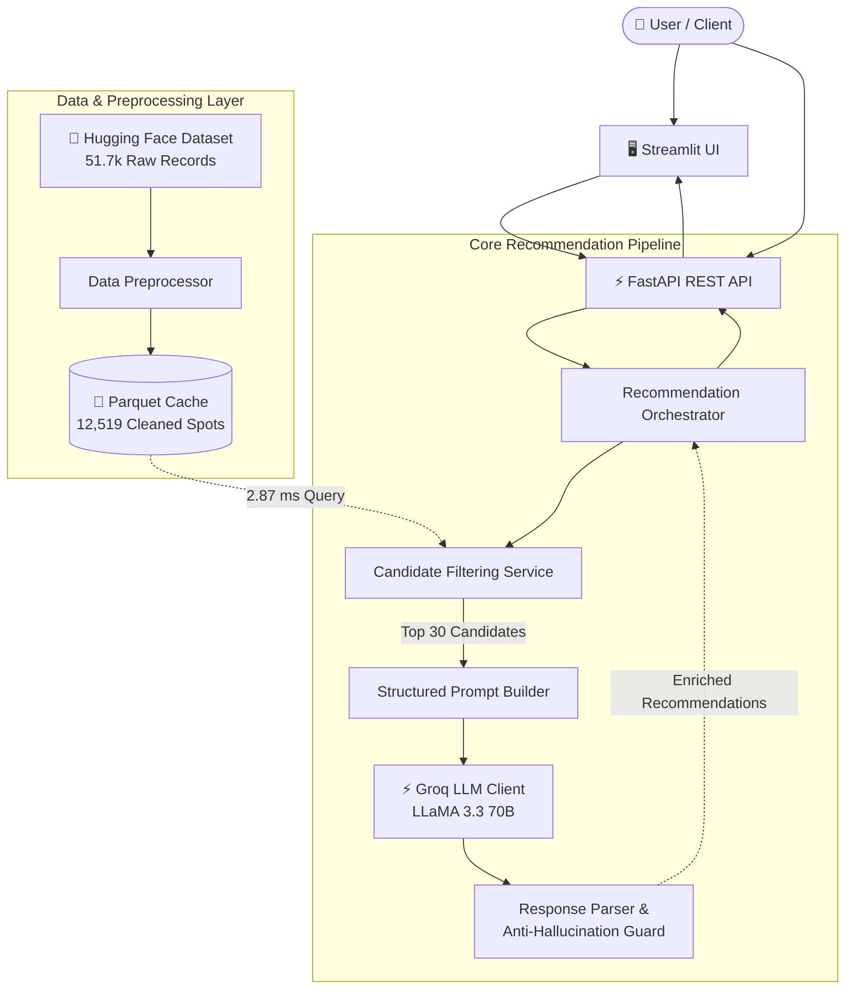

# 🍽️ AI-Powered Restaurant Recommendation System (Zomato Use Case)

An intelligent, production-ready restaurant recommendation system inspired by Zomato. The application combines **deterministic structured data retrieval** over 12,500+ restaurants with **Groq LLM reasoning (LLaMA 3.3 70B)** to deliver personalized, human-like restaurant suggestions with tailored explanations.

---

## 🌐 Live Production Deployments

| Component | Platform | Live URL | Status |
|---|---|---|---|
| **Modern Web UI** | **Vercel** | [zomato-ai-project-pi.vercel.app](https://zomato-ai-project-pi.vercel.app) | 🟢 Live |
| **FastAPI REST API Backend** | **Render** | [zomato-ai-project.onrender.com](https://zomato-ai-project.onrender.com) | 🟢 Live |
| **Interactive API Documentation** | **Render Swagger UI** | [zomato-ai-project.onrender.com/docs](https://zomato-ai-project.onrender.com/docs) | 🟢 Live |

---

## 🌟 Highlights & Architecture

The system employs a high-performance **Retrieve-Then-Reason** architecture:



### Key Capabilities
- **Fast Local Parquet Caching**: Parses, normalizes, and deduplicates the Hugging Face dataset into a local 554 KB Parquet cache that reloads in **81 ms** ($< 100\text{ ms}$).
- **High-Speed Deterministic Filtering**: Narrows 12,519 restaurants across 93 Bangalore localities by locality, cuisine, budget tier, and minimum rating in **2.87 ms**.
- **Staged Filter Relaxation**: When criteria yield fewer than 3 matches, the system gracefully expands the search: `Budget` $\rightarrow$ `Cuisine` $\rightarrow$ `Rating`.
- **Zero Hallucination Guard**: Every restaurant suggested by the LLM is strictly cross-referenced against the candidate shortlist; invented restaurants are dropped. Ground-truth attributes (`rating`, `cost_for_two`, `cuisine`) are enriched directly from the dataset.
- **Graceful Degradation & Fallback**: If `GROQ_API_KEY` is not provided or if Groq times out / rate limits, an intelligent template-based fallback generator produces ranking and explanations without failing the request.
- **Dual-Mode Streamlit Web UI**: Interactive web interface with Zomato branding that works with the FastAPI backend or runs standalone in-process.

---

## 🚀 Quickstart Guide

### 1. Prerequisites
- Python 3.11, 3.12, or 3.14
- (Optional) Groq API Key from [console.groq.com](https://console.groq.com/keys) for real LLM reasoning.

### 2. Installation
```bash
# 1. Clone repository
git clone <repo-url>
cd "Zomato Milestone"

# 2. Create virtual environment
python3 -m venv .venv
source .venv/bin/activate

# 3. Install dependencies
pip install -r requirements.txt
```

### 3. Configure Environment
```bash
cp .env.example .env
```
Open `.env` and optionally set your Groq API key:
```ini
GROQ_API_KEY=gsk_your_actual_groq_api_key_here
GROQ_MODEL=llama-3.3-70b-versatile
```
*(Note: If `GROQ_API_KEY` is omitted, the app automatically switches to the built-in Intelligent Fallback Engine).*

---

## 🏃 Running the Application

### Option A: Launch Streamlit Web UI
```bash
.venv/bin/streamlit run ui/streamlit_app.py
```
Open [http://localhost:8501](http://localhost:8501) in your browser.

### Option B: Launch FastAPI REST API
```bash
.venv/bin/uvicorn app.main:app --reload --port 8000
```
Interactive Swagger API documentation will be available at [http://localhost:8000/docs](http://localhost:8000/docs).

### Option C: Run via Docker
```bash
# Build Docker image
docker build -t zomato-recommender .

# Run FastAPI backend
docker run -p 8000:8000 -e GROQ_API_KEY="your-key" zomato-recommender

# Or run Streamlit UI
docker run -p 8501:8501 -e GROQ_API_KEY="your-key" zomato-recommender streamlit run ui/streamlit_app.py --server.port=8501 --server.address=0.0.0.0
```

---

## 📡 REST API Reference

### 1. Health Check
```bash
curl http://localhost:8000/health
```
```json
{
  "status": "ok",
  "groq_configured": true,
  "dataset": "ManikaSaini/zomato-restaurant-recommendation",
  "dataset_loaded": true
}
```

### 2. Dataset Status
```bash
curl http://localhost:8000/api/v1/dataset/status
```
```json
{
  "status": "loaded",
  "is_loaded": true,
  "row_count": 12519,
  "locations_count": 93,
  "sample_locations": ["banashankari", "indiranagar", "koramangala", "whitefield"],
  "budget_distribution": {
    "low": 9095,
    "medium": 3138,
    "high": 286
  }
}
```

### 3. Get Recommendations
```bash
curl -X POST http://localhost:8000/api/v1/recommendations \
  -H "Content-Type: application/json" \
  -d '{
    "location": "indiranagar",
    "budget": "medium",
    "cuisine": "Italian",
    "min_rating": 4.0,
    "additional_preferences": "outdoor seating",
    "top_k": 3
  }'
```
**Response JSON:**
```json
{
  "recommendations": [
    {
      "name": "Milano Pizzeria",
      "cuisine": "Italian, Pizza",
      "rating": 4.5,
      "estimated_cost": 1200,
      "explanation": "Famous for artisanal thin-crust pizzas with pleasant outdoor patio seating in Indiranagar."
    }
  ],
  "summary": "Top recommended Italian spots in Indiranagar matching your budget and ambiance preferences.",
  "metadata": {
    "source": "groq",
    "candidates_considered": 18,
    "total_matching": 18,
    "latency_ms": 1120.4,
    "model": "llama-3.3-70b-versatile"
  }
}
```

---

## 🧪 Testing & Validation

The project includes an exhaustive suite of unit, integration, and contract tests:
```bash
# Run all tests
.venv/bin/pytest -v
```

### Test Breakdown
| Suite | Scope |
|---|---|
| `tests/test_preprocessor.py` | Missing fields, rating parsing (`"4.1/5"`, `"NEW"`, `"-"`), cost parsing with commas, budget tiers |
| `tests/test_dataset_loader.py` | Parquet cache hits ($<100\text{ ms}$), corrupted file recovery, thread-safety |
| `tests/test_filtering.py` | Multi-criteria filtering, composite scoring, cap enforcement, relaxation logic, benchmark ($2.87\text{ ms}$) |
| `tests/test_prompt_builder.py` | Anti-hallucination prompt generation, token efficiency, JSON schema specification |
| `tests/test_response_parser.py` | Markdown code fence removal, hallucinated restaurant dropping, ground-truth enrichment |
| `tests/test_groq_client.py` | Mock completions, 429 rate limit retries, timeout handling |
| `tests/test_orchestrator.py` | End-to-end pipeline coordination, zero-candidate short-circuiting, graceful fallback |
| `tests/test_api.py` | FastAPI HTTP request/response validation, 422 error details, dependency injection overrides |
| `tests/test_ui_smoke.py` | Streamlit UI imports, dual-backend routing, card layout generation |
| `tests/test_edge_cases.py` | 5-scenario E2E matrix across Bangalore neighborhoods, unicode characters, schema contract compliance |

---

## 📊 Dataset Attribution
- **Dataset**: [ManikaSaini/zomato-restaurant-recommendation](https://huggingface.co/datasets/ManikaSaini/zomato-restaurant-recommendation) on Hugging Face.
- **Coverage**: 51,717 raw entries preprocessed into 12,519 deduplicated restaurants across 93 Bangalore localities.
- **Fields**: Name, Locality, Cuisines, Cost for Two, Rating, Review Votes, Address, Restaurant Type.
