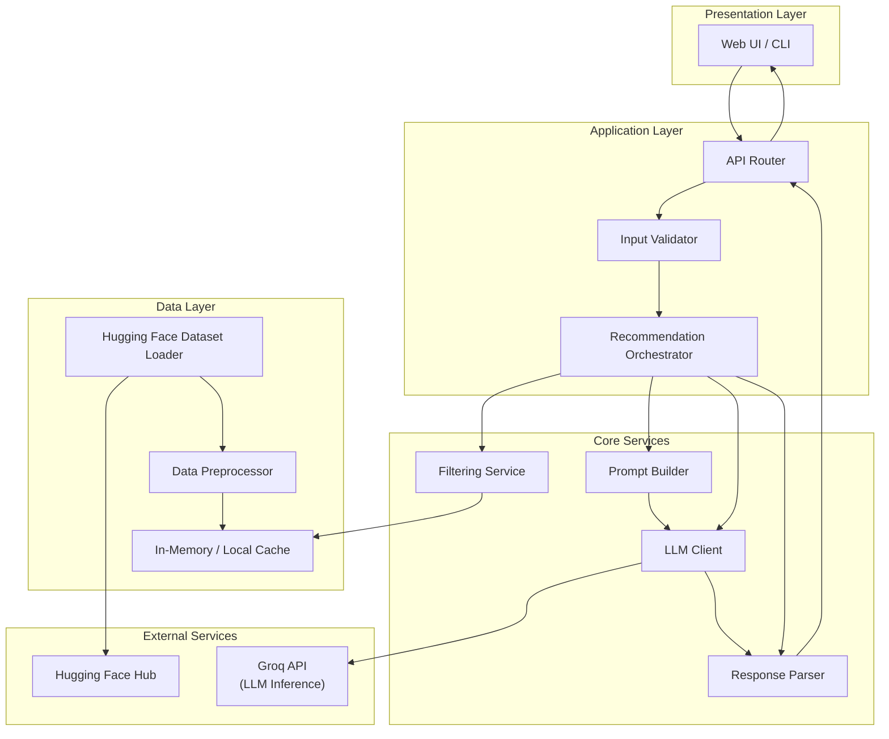
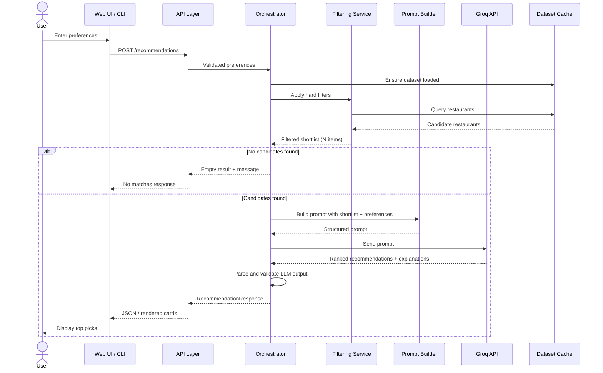
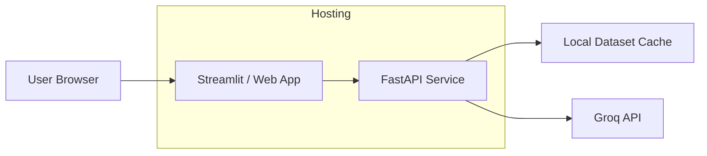

# Architecture: AI-Powered Restaurant Recommendation System

## 1. Executive Summary

This document describes the architecture for an AI-powered restaurant recommendation service inspired by Zomato. The system accepts user dining preferences, filters a real-world Zomato restaurant dataset, and uses **Groq** as the LLM provider to rank, explain, and present personalized restaurant recommendations.

The design follows a **retrieve-then-reason** pattern: structured filtering narrows the candidate set from thousands of restaurants to a manageable shortlist, and the LLM performs semantic ranking and natural-language explanation on that shortlist. This approach balances accuracy, latency, and cost.

---


## 2. Goals and Non-Goals


### Goals

- Accept structured user preferences (location, budget, cuisine, minimum rating, free-text extras)
- Load and preprocess the [ManikaSaini/zomato-restaurant-recommendation](https://huggingface.co/datasets/ManikaSaini/zomato-restaurant-recommendation) dataset from Hugging Face
- Filter restaurants deterministically before LLM invocation
- Use Groq-hosted LLMs to rank candidates and generate human-readable explanations
- Present results in a clear, scannable format (name, cuisine, rating, cost, explanation)


### Non-Goals (Initial Version)

- Real-time restaurant availability or booking
- User accounts, authentication, or persistent preference history
- Geospatial routing or distance calculations (unless added later)
- Training or fine-tuning a custom recommendation model
- Multi-turn conversational refinement (can be a future enhancement)

---


## 3. High-Level Architecture




---


## 4. System Workflow

The end-to-end flow maps directly to the five stages defined in the product requirements:


| Stage                    | Layer                | Description                                                     |
| ------------------------ | -------------------- | --------------------------------------------------------------- |
| 1. Data Ingestion        | Data Layer           | Load dataset from Hugging Face, normalize fields, cache locally |
| 2. User Input            | Presentation + API   | Collect and validate preferences                                |
| 3. Integration           | Core Services        | Filter candidates, build LLM prompt                             |
| 4. Recommendation Engine | Core Services + Groq | Rank, explain, optionally summarize                             |
| 5. Output Display        | Presentation Layer   | Render structured recommendations                               |


### Sequence Diagram




---


## 5. Component Architecture


### 5.1 Presentation Layer

**Responsibility:** Collect user preferences and display recommendations.


| Element       | Details                                                                        |
| ------------- | ------------------------------------------------------------------------------ |
| Input fields  | Location, budget tier, cuisine, minimum rating, optional free-text preferences |
| Output fields | Restaurant name, cuisine, rating, estimated cost, AI explanation               |
| UX pattern    | Single-page form → loading state → results cards                               |


**Implementation options:**

- **Web UI (recommended):** Streamlit or Gradio for rapid prototyping; React/Vite for production polish
- **CLI:** Useful for development, testing, and demos


### 5.2 Application Layer (API)

**Responsibility:** HTTP boundary, request validation, orchestration entry point.

```
POST /api/v1/recommendations
GET  /api/v1/health
GET  /api/v1/dataset/status   (optional: load progress, row count)
```

**Key behaviors:**

- Validate and normalize all inputs before downstream processing
- Enforce timeouts on LLM calls
- Return consistent error envelopes (validation errors, no results, LLM failures)


### 5.3 Recommendation Orchestrator

**Responsibility:** Coordinate the full recommendation pipeline as a single use case.

```python
# Pseudocode
def get_recommendations(preferences: UserPreferences) -> RecommendationResponse:
    candidates = filtering_service.filter(preferences)
    if not candidates:
        return RecommendationResponse.empty(preferences)

    prompt = prompt_builder.build(preferences, candidates)
    llm_output = groq_client.complete(prompt)
    parsed = response_parser.parse(llm_output)

    return RecommendationResponse(
        preferences=preferences,
        recommendations=parsed.top_k,
        summary=parsed.summary,
        metadata={"candidates_considered": len(candidates)}
    )
```

The orchestrator is the only component that knows the full pipeline. Individual services remain independently testable.

### 5.5 Data Layer


#### Dataset Loader

- **Source:** [ManikaSaini/zomato-restaurant-recommendation](https://huggingface.co/datasets/ManikaSaini/zomato-restaurant-recommendation)
- **Library:** `datasets` (Hugging Face)
- **Load strategy:** Lazy load on first request or eager load at application startup
- **Persistence:** Optional local parquet/CSV cache to avoid repeated downloads


#### Preprocessor

Normalizes raw dataset rows into a canonical `Restaurant` schema:


| Field          | Type         | Notes                                                   |
| -------------- | ------------ | ------------------------------------------------------- |
| `name`         | string       | Restaurant name                                         |
| `location`     | string       | City or locality (normalized, e.g., lowercase, trimmed) |
| `cuisines`     | list[string] | Split multi-value cuisine strings                       |
| `cost_for_two` | integer      | Estimated cost for two people (INR)                     |
| `rating`       | float        | Normalized to 0.0–5.0 scale                             |
| `votes`        | integer      | Optional; useful for tie-breaking                       |
| `address`      | string       | Optional display field                                  |
| `rest_type`    | string       | Optional (e.g., casual dining, cafe)                    |


**Preprocessing steps:**

1. Drop or impute rows with missing critical fields (name, location)
2. Normalize location strings for case-insensitive matching
3. Parse cuisine strings (comma-separated → list)
4. Map raw cost/rating columns to typed values
5. Derive `budget_tier` enum from `cost_for_two` thresholds

**Suggested budget tier mapping:**


| Tier     | Cost for Two (INR) |
| -------- | ------------------ |
| `low`    | ≤ 500              |
| `medium` | 501 – 1500         |
| `high`   | > 1500             |


*(Thresholds should be calibrated against actual dataset distribution during implementation.)*

#### In-Memory Cache

- Store preprocessed records as a list or pandas DataFrame
- Enable fast vectorized filtering
- Reload only when cache is stale or missing


### 5.6 Filtering Service

**Responsibility:** Deterministic, rule-based narrowing of the dataset before LLM invocation.

**Filter rules (applied in order):**

1. **Location** — exact or fuzzy match on city/locality
2. **Cuisine** — any-match against user's selected cuisine(s)
3. **Minimum rating** — `rating >= min_rating`
4. **Budget** — map user tier to cost range
5. **Optional keyword filter** — simple text match on restaurant attributes for free-text preferences (e.g., "family-friendly")

**Output constraints:**

- Cap shortlist size (recommended: **20–50 restaurants**) to control prompt size and LLM cost
- If results exceed cap, pre-sort by rating × vote weight and take top N
- If results are below minimum (e.g., < 3), relax filters in order: budget → cuisine → rating (configurable fallback strategy)

**Why filter before LLM?**

- Reduces token usage and latency
- Prevents hallucination of non-existent restaurants
- Grounds LLM reasoning in real data only


### 5.7 Prompt Builder

**Responsibility:** Construct a structured, deterministic prompt from user preferences and filtered candidates.

**Prompt structure:**

```
[System]
You are a restaurant recommendation assistant for Zomato-style dining suggestions in India.
You must ONLY recommend restaurants from the provided list.
Do not invent restaurants. Rank by best fit to user preferences.

[User Preferences]
- Location: {location}
- Budget: {budget}
- Cuisine: {cuisine}
- Minimum rating: {min_rating}
- Additional preferences: {extras}

[Candidate Restaurants]
{json_or_table_of_candidates}

[Task]
1. Select the top {k} restaurants (default: 5).
2. Rank them from best to worst fit.
3. For each, write a 1–2 sentence explanation of why it matches the user's preferences.
4. Optionally provide a one-sentence summary of the overall selection.

[Output Format]
Return valid JSON matching this schema:
{
  "recommendations": [
    {
      "name": "...",
      "cuisine": "...",
      "rating": 4.2,
      "estimated_cost": 800,
      "explanation": "..."
    }
  ],
  "summary": "..."
}
```

**Design principles:**

- Include only fields the LLM needs for reasoning
- Use JSON output format for reliable parsing
- Set temperature low (0.2–0.4) for consistent rankings
- Include explicit anti-hallucination instructions


### 5.8 Groq LLM Client

**Responsibility:** Send prompts to the Groq API and return structured text responses.

**Provider:** [Groq](https://groq.com/) — high-speed LLM inference with an OpenAI-compatible chat completions API.

**Recommended models:**


| Model                     | Use Case                                                |
| ------------------------- | ------------------------------------------------------- |
| `llama-3.3-70b-versatile` | Default — strong reasoning for ranking and explanations |
| `llama-3.1-8b-instant`    | Faster, lower-cost option for demos and dev             |
| `mixtral-8x7b-32768`      | Alternative with larger context window                  |


**Client implementation:**

```python
from groq import Groq

class GroqLLMClient:
    def __init__(self, api_key: str, model: str, temperature: float, timeout: int):
        self.client = Groq(api_key=api_key)
        self.model = model
        self.temperature = temperature
        self.timeout = timeout

    def complete(self, prompt: str, *, max_tokens: int = 2048) -> str:
        response = self.client.chat.completions.create(
            model=self.model,
            messages=[{"role": "user", "content": prompt}],
            temperature=self.temperature,
            max_tokens=max_tokens,
            response_format={"type": "json_object"},  # enforce JSON when supported
        )
        return response.choices[0].message.content
```

**Operational concerns:**

- Retry with exponential backoff on transient failures (rate limits, 5xx errors)
- Configurable timeout (recommended: 30s)
- Handle Groq rate limits (`429`) with backoff and clear user-facing messages
- Log prompt hash and token usage (not raw PII)
- `GROQ_API_KEY` loaded from environment variables, never hardcoded
- Use `response_format={"type": "json_object"}` where the selected model supports it to improve parse reliability


### 5.9 Response Parser

**Responsibility:** Parse, validate, and enrich LLM output.

**Steps:**

1. Extract JSON from LLM response (handle markdown code fences)
2. Validate against Pydantic schema
3. Cross-check returned restaurant names against the filtered candidate list
4. Drop or flag hallucinated entries not in the candidate set
5. Fill missing display fields from dataset if LLM omitted them

**Fallback behavior:**

- If JSON parsing fails, retry once with a "return only JSON" correction prompt
- If retry fails, return top filtered restaurants with a generic explanation template

---


## 6. Data Models


### UserPreferences

```python
class UserPreferences(BaseModel):
    location: str
    budget: Literal["low", "medium", "high"]
    cuisine: str                          # or list[str] for multi-select
    min_rating: float = Field(ge=0, le=5)
    additional_preferences: str | None = None
    top_k: int = Field(default=5, ge=1, le=10)
```


### Restaurant (internal)

```python
class Restaurant(BaseModel):
    name: str
    location: str
    cuisines: list[str]
    cost_for_two: int
    rating: float
    votes: int | None = None
    address: str | None = None
    rest_type: str | None = None
    budget_tier: Literal["low", "medium", "high"]
```


### Recommendation (API response)

```python
class Recommendation(BaseModel):
    name: str
    cuisine: str
    rating: float
    estimated_cost: int
    explanation: str

class RecommendationResponse(BaseModel):
    recommendations: list[Recommendation]
    summary: str | None
    metadata: dict  # e.g., candidates_considered, filters_applied
```

---


## 7. Directory Structure (Proposed)

```
zomato-recommendation/
├── app/
│   ├── __init__.py
│   ├── main.py                 # FastAPI / Streamlit entry point
│   ├── config.py               # Settings, env vars, thresholds
│   ├── models/
│   │   ├── preferences.py
│   │   ├── restaurant.py
│   │   └── response.py
│   ├── services/
│   │   ├── dataset_loader.py
│   │   ├── preprocessor.py
│   │   ├── filtering.py
│   │   ├── prompt_builder.py
│   │   ├── groq_client.py      # Groq LLM client
│   │   ├── response_parser.py
│   │   └── orchestrator.py
│   └── api/
│       ├── routes.py
│       └── dependencies.py
├── ui/
│   └── streamlit_app.py        # Optional separate UI
├── tests/
│   ├── test_filtering.py
│   ├── test_prompt_builder.py
│   ├── test_response_parser.py
│   └── fixtures/
│       └── sample_restaurants.json
├── data/
│   └── .gitkeep                # Local cache (gitignored)
├── .env.example
├── requirements.txt
├── README.md
├── context.md
└── architecture.md
```

---


## 8. Technology Stack


| Layer            | Recommended          | Alternatives                |
| ---------------- | -------------------- | --------------------------- |
| Language         | Python 3.11+         | —                           |
| API framework    | FastAPI              | Flask                       |
| UI               | Streamlit            | Gradio, React               |
| Data loading     | `datasets`, `pandas` | Polars                      |
| Validation       | Pydantic v2          | dataclasses                 |
| LLM SDK          | `groq`               | LangChain + Groq (optional) |
| Config           | `pydantic-settings`  | python-dotenv               |
| Testing          | pytest               | unittest                    |
| Containerization | Docker (optional)    | —                           |


---


## 9. Configuration

Environment variables (`.env`):

```bash
# Groq LLM
GROQ_API_KEY=gsk_...
GROQ_MODEL=llama-3.3-70b-versatile
GROQ_TEMPERATURE=0.3
GROQ_MAX_TOKENS=2048
GROQ_TIMEOUT_SECONDS=30

# Dataset
HF_DATASET_NAME=ManikaSaini/zomato-restaurant-recommendation
DATASET_CACHE_PATH=./data/restaurants.parquet

# Filtering
MAX_CANDIDATES_FOR_LLM=30
BUDGET_LOW_MAX=500
BUDGET_MEDIUM_MAX=1500

# App
TOP_K_DEFAULT=5
LOG_LEVEL=INFO
```

All thresholds (budget tiers, candidate caps, fallback rules) should live in `config.py` for easy tuning without code changes.

---


## 10. Error Handling and Edge Cases


| Scenario                     | Behavior                                                              |
| ---------------------------- | --------------------------------------------------------------------- |
| Dataset download fails       | Retry 3×; surface clear error with link to manual download            |
| No restaurants match filters | Return empty list with suggestions to broaden criteria                |
| Too few matches (< 3)        | Apply relaxed filter fallback or return all matches with note         |
| Groq API timeout             | Retry once; fallback to rating-sorted list with template explanations |
| Groq rate limit (429)        | Exponential backoff; surface friendly "try again" message             |
| LLM returns invalid JSON     | Retry with correction prompt; then fallback                           |
| LLM hallucinates restaurant  | Response parser drops entries not in candidate set                    |
| Invalid user input           | 422 validation error with field-level messages                        |


---


## 11. Performance and Cost Considerations


### Latency Budget (Target)


| Step                  | Target    |
| --------------------- | --------- |
| Dataset load (cached) | < 100 ms  |
| Filtering             | < 200 ms  |
| Groq LLM call         | 0.5–2 s   |
| Parse + respond       | < 100 ms  |
| **Total**             | **< 3 s** |


Groq's inference speed is a key architectural advantage — most latency comes from filtering and network round-trip, not model generation.

### Cost Control

- Filter aggressively before LLM to minimize input tokens
- Cap candidate list at 20–30 restaurants
- Use `llama-3.1-8b-instant` for dev/demo; `llama-3.3-70b-versatile` for production-quality rankings
- Cache identical preference queries (optional, short TTL)
- Monitor Groq rate limits and token usage per request


### Scalability Notes

- For demo/MVP: single-process in-memory dataset is sufficient
- For production: consider Redis cache, async LLM calls, and horizontal API scaling
- Dataset is read-only; no write contention

---


## 12. Security and Privacy

- **API keys:** `GROQ_API_KEY` stored in environment variables; never committed to version control
- **User input:** Sanitize free-text preferences; no persistent storage of PII in MVP
- **LLM data:** Only send restaurant metadata and preferences needed for ranking to Groq; avoid sending internal IDs or sensitive fields
- **Rate limiting:** Apply at API gateway if exposed publicly
- **Dependencies:** Pin versions in `requirements.txt`; scan for vulnerabilities in CI

---


## 13. Testing Strategy


| Test Type   | Scope                                                                        |
| ----------- | ---------------------------------------------------------------------------- |
| Unit        | Filtering logic, budget tier mapping, prompt template rendering, JSON parser |
| Integration | Dataset load → filter → mock LLM → response                                  |
| Contract    | LLM output schema validation, anti-hallucination checks                      |
| E2E         | UI form submission → displayed recommendations                               |


**Mocking:** Groq client should be mockable to run tests without API calls or rate limits.

---


## 14. Deployment Architecture (Optional)




**MVP deployment options:**

- **Local:** `streamlit run ui/streamlit_app.py`
- **Cloud (simple):** Streamlit Community Cloud, Render, or Railway
- **Containerized:** Single Docker image with dataset baked or downloaded on startup

---


## 15. Future Enhancements


| Enhancement               | Description                                                        |
| ------------------------- | ------------------------------------------------------------------ |
| Conversational refinement | Multi-turn chat to adjust preferences                              |
| Semantic search           | Embedding-based cuisine/preference matching beyond keyword filters |
| User profiles             | Save preferences and recommendation history                        |
| Geolocation               | Distance-based filtering and sorting                               |
| Feedback loop             | Thumbs up/down to improve future prompts                           |
| A/B testing               | Compare Groq models (e.g., 8B vs 70B) and prompt variants          |
| Observability             | Langfuse / OpenTelemetry for prompt and latency tracing            |


---


## 16. Component Responsibility Matrix


| Component       | Responsibility                      | Inputs                    | Outputs            |
| --------------- | ----------------------------------- | ------------------------- | ------------------ |
| Dataset         | Source of truth for restaurant data | Hugging Face Hub          | Raw records        |
| Dataset Loader  | Fetch and cache dataset             | HF dataset name           | Raw dataframe      |
| Preprocessor    | Normalize schema                    | Raw records               | `Restaurant[]`     |
| User Input      | Capture preferences                 | User form                 | `UserPreferences`  |
| Filtering Layer | Rule-based candidate selection      | Preferences + restaurants | Filtered shortlist |
| Prompt Builder  | Construct LLM prompt                | Preferences + shortlist   | Prompt string      |
| Groq LLM        | Rank, explain, summarize            | Prompt                    | JSON text          |
| Response Parser | Validate and enrich                 | LLM output + candidates   | `Recommendation[]` |
| Output Display  | Render results                      | API response              | UI cards / JSON    |


---


## 17. Summary

The architecture separates **deterministic retrieval** (dataset loading, preprocessing, rule-based filtering) from **probabilistic reasoning** (LLM ranking and explanation). This split ensures recommendations are always grounded in real Zomato data while leveraging the LLM's strength in personalization and natural-language output.

The system is designed as a modular Python application with a thin API layer, a Groq-powered LLM client, and a clear data pipeline from Hugging Face ingestion to user-facing recommendation cards. The MVP can be delivered quickly with Streamlit + FastAPI + Groq, benefiting from Groq's low-latency inference for a responsive user experience.