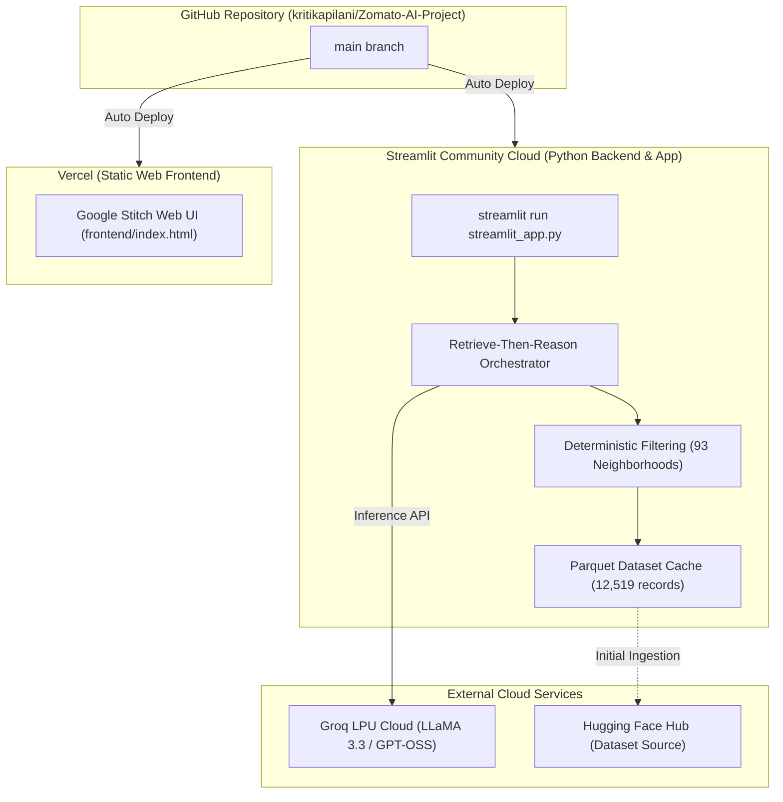

# Deployment Plan: Zomato AI Restaurant Recommender

This document provides a production-ready guide to deploying the **Zomato AI Restaurant Recommender** application across cloud platforms:
- **Primary Backend / Python App:** [Streamlit Community Cloud](https://share.streamlit.io) (100% Free 1-Click Hosting from GitHub)
- **Frontend / Modern Web UI:** [Vercel](https://vercel.com) (Edge CDN-hosted Google Stitch Design)
- **Alternative Backend:** [Railway](https://railway.app) (Containerized FastAPI REST API)

---

## 1. System Architecture & Topology



---

## 2. Pre-Deployment Checklist

| Item | Requirement | Status / Notes |
|---|---|---|
| **GitHub Repository** | Code pushed to [github.com/kritikapilani/Zomato-AI-Project](https://github.com/kritikapilani/Zomato-AI-Project) | ✅ Verified (`main` branch) |
| **Streamlit Account** | Free account at [share.streamlit.io](https://share.streamlit.io) (sign in with GitHub) | Free / No Credit Card Required |
| **Vercel Account** | Free account at [vercel.com](https://vercel.com) (sign in with GitHub) | Free / No Credit Card Required |
| **Groq API Key** | `gsk_...` key from [console.groq.com](https://console.groq.com) | Required |
| **Secrets Safety** | `.env` and `.streamlit/secrets.toml` are in `.gitignore` | ✅ Verified |
| **Test Suite** | All 76 automated tests passing | ✅ Verified |

---

## 3. Phase 1: Deploy Backend on Streamlit Community Cloud

Streamlit Community Cloud provides 100% free, zero-config hosting for Python data applications with continuous deployment from GitHub.

### Step 1: Sign in to Streamlit Community Cloud
1. Navigate to **[share.streamlit.io](https://share.streamlit.io)**.
2. Sign in with your **GitHub account** (`kritikapilani`).

### Step 2: Create a New Streamlit App
1. Click the **"Create app"** (or **"New app"**) button.
2. Choose **"Deploy a public app from GitHub"**.
3. Fill in the repository details:
   - **Repository:** `kritikapilani/Zomato-AI-Project`
   - **Branch:** `main`
   - **Main file path:** `streamlit_app.py`
   - **App URL (optional):** Customize your subdomain (e.g. `zomato-ai-recommender.streamlit.app`).

### Step 3: Configure Streamlit Secrets
1. In the deployment configuration (or under **App settings** $\rightarrow$ **Secrets**), paste:
   ```toml
   GROQ_API_KEY = "gsk_your_actual_groq_key_here"
   GROQ_MODEL = "llama-3.3-70b-versatile"
   HF_DATASET_NAME = "ManikaSaini/zomato-restaurant-recommendation"
   DATASET_CACHE_PATH = "./data/restaurants.parquet"
   LOG_LEVEL = "INFO"
   ```
2. Click **"Save"**.

### Step 4: Click "Deploy!"
1. Click **"Deploy!"**.
2. Streamlit Cloud will automatically install dependencies from `requirements.txt`, configure theme settings from `.streamlit/config.toml`, download the Hugging Face dataset, and launch the application.
3. Your app will be live at:
   `https://<your-app-subdomain>.streamlit.app`

---

## 4. Phase 2: Deploy Frontend on Vercel

Vercel provides edge hosting with global CDN distribution and instant deployments for the modern web UI.

### Step 1: Import Project into Vercel
1. Log in to [vercel.com](https://vercel.com).
2. Click **"Add New..."** $\rightarrow$ **"Project"**.
3. Import your GitHub repository: **`kritikapilani/Zomato-AI-Project`**.
4. Configure Project Settings:
   - **Framework Preset:** `Other`
   - **Root Directory:** `./`
   - **Build Command:** *(Leave empty / not required for static web app)*
   - **Output Directory:** *(Leave empty / defaults to root)*

### Step 2: Deploy
1. Click **"Deploy"**.
2. Vercel will build and assign a production domain (e.g., `https://zomato-ai-project.vercel.app`).
3. Routing is configured automatically via `vercel.json`:
   - Clean URLs enabled.
   - Root requests route to `/frontend/index.html`.

---

## 5. Alternative: Containerized Backend on Railway

If you also want a headless containerized FastAPI REST API alongside Streamlit:
1. Log in to [railway.app](https://railway.app) and select **"Deploy from GitHub repo"** (`kritikapilani/Zomato-AI-Project`).
2. Add variables: `GROQ_API_KEY`, `GROQ_MODEL=openai/gpt-oss-120b`.
3. Generate Domain in **Settings $\rightarrow$ Networking** with healthcheck `/health`.

---

## 6. Continuous Deployment Workflow

Both Streamlit Cloud and Vercel are connected to your GitHub repository:
- Any `git push origin main` triggers an automatic zero-downtime update across both platforms.
- If you update prompts, filtering rules, or UI themes, changes go live within seconds of committing to `main`.
