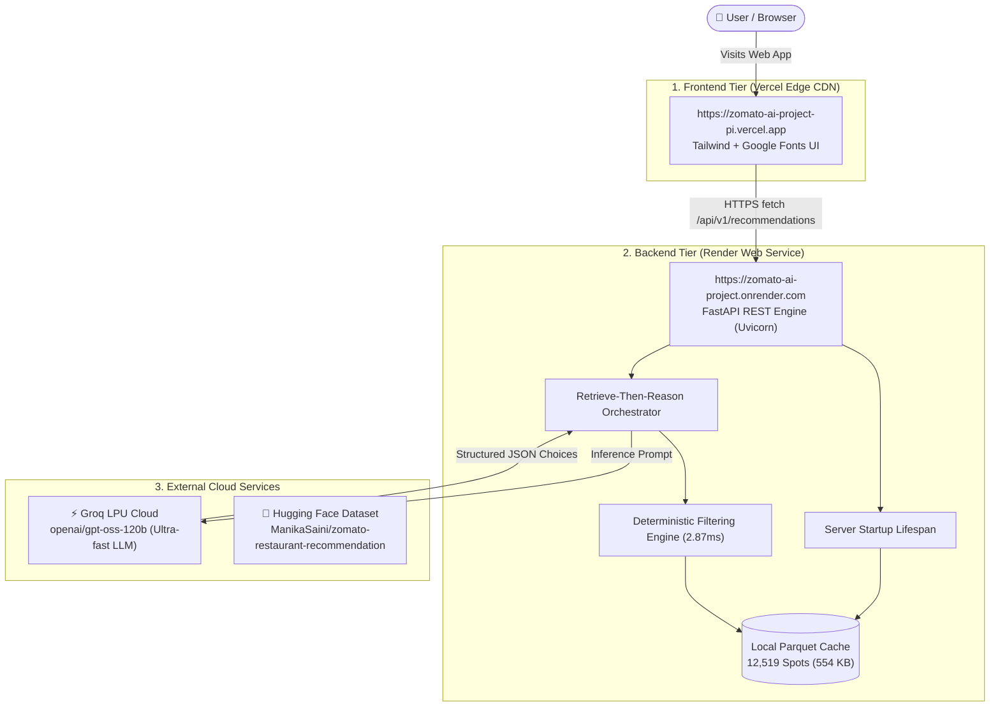

# Production Deployment Guide: Vercel (Frontend) + Render (Backend)

This document details the production architecture for the **Zomato AI Restaurant Recommender** system:
- **Web Frontend:** [Vercel](https://vercel.com) — Global Edge CDN hosting the responsive web UI.
- **Backend REST API:** [Render](https://render.com) — High-performance Python FastAPI service with pre-warmed Parquet caching and Groq LLM inference.

---

## 1. Live Deployment Topology



---

## 2. Live Production URLs

| Tier | Service | URL | Purpose |
|---|---|---|---|
| **Frontend** | **Vercel** | [https://zomato-ai-project-pi.vercel.app](https://zomato-ai-project-pi.vercel.app) | User-facing responsive search & recommendation UI |
| **Backend** | **Render** | [https://zomato-ai-project.onrender.com](https://zomato-ai-project.onrender.com) | Python FastAPI REST API with CORS enabled |
| **API Docs** | **Render Swagger** | [https://zomato-ai-project.onrender.com/docs](https://zomato-ai-project.onrender.com/docs) | Interactive OpenAPI documentation & testing |
| **Health** | **Render Healthcheck** | [https://zomato-ai-project.onrender.com/health](https://zomato-ai-project.onrender.com/health) | Live system status & dataset verification |

---

## 3. Frontend Deployment (Vercel)

The frontend is served directly by Vercel's global Edge CDN:
- **Files:** `frontend/index.html`, `frontend/config.js`, `frontend/assets/`
- **Output Directory:** `frontend` (or root `public/`)
- **Framework Preset:** `Other`
- **Runtime Configuration:** `config.js` sets the default backend URL:
  ```javascript
  window.__BACKEND_URL__ = "https://zomato-ai-project.onrender.com";
  ```
- **Live Features:**
  - Dynamic locality dropdown (93 Bangalore neighborhoods)
  - Budget tiers (Low $\le ₹500$, Medium $\le ₹1500$, High $> ₹1500$)
  - Cuisine selector and custom dietary preferences
  - Live backend health indicator and connection status

---

## 4. Backend Deployment (Render)

The backend runs as a continuous Python Web Service on Render configured via [`render.yaml`](./render.yaml):
- **Build Command:** `pip install -r requirements.txt`
- **Start Command:** `uvicorn app.main:app --host 0.0.0.0 --port $PORT`
- **Health Check Path:** `/health`
- **Startup Lifespan:** Automatically pre-warms the 12,519 restaurant dataset from `data/restaurants.parquet` into memory on server boot (<100ms load time).
- **Environment Variables:**
  - `GROQ_API_KEY`: Groq inference key
  - `GROQ_MODEL`: `openai/gpt-oss-120b`
  - `HF_DATASET_NAME`: `ManikaSaini/zomato-restaurant-recommendation`
  - `DATASET_CACHE_PATH`: `./data/restaurants.parquet`

---

## 5. Continuous Deployment (CI/CD)

Both platforms are connected to the `main` branch of [github.com/kritikapilani/Zomato-AI-Project](https://github.com/kritikapilani/Zomato-AI-Project):
1. **Frontend Updates:** Any edits to `frontend/` trigger an instant zero-downtime CDN cache purge on Vercel.
2. **Backend Updates:** Any edits to `app/` trigger an automated rolling rebuild and zero-downtime container replacement on Render.
