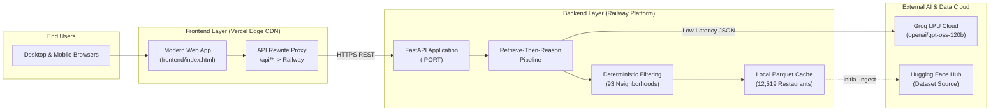

# Deployment Plan: Zomato AI Restaurant Recommender

This document provides a comprehensive, production-ready guide to deploying the **Zomato AI Restaurant Recommender** application across a decoupled cloud infrastructure:
- **Backend:** [Railway](https://railway.app) (FastAPI + Groq LLM Orchestrator + In-Memory/Parquet Caching)
- **Frontend:** [Vercel](https://vercel.com) (Edge CDN-hosted Modern Web UI)

---

## 1. System Architecture & Topology



---

## 2. Pre-Deployment Checklist

| Item | Requirement | Status / Notes |
|---|---|---|
| **GitHub Repository** | Code pushed to [github.com/kritikapilani/Zomato-AI-Project](https://github.com/kritikapilani/Zomato-AI-Project) | ✅ Ready |
| **Railway Account** | Active account at [railway.app](https://railway.app) | Required |
| **Vercel Account** | Active account at [vercel.com](https://vercel.com) | Required |
| **Groq API Key** | `gsk_...` key from [console.groq.com](https://console.groq.com) | Required |
| **Secret Protection** | `.env` is listed in `.gitignore` and not committed | ✅ Verified |
| **Health Check Endpoint** | `GET /health` returns `200 OK` | ✅ Verified |

---

## 3. Phase 1: Deploy Backend to Railway

Railway runs containerized backend workloads with automatic HTTPS, continuous deployment from GitHub, and dynamic port binding.

### Step 1: Create a Railway Project
1. Log in to [railway.app](https://railway.app).
2. Click **"New Project"** $\rightarrow$ **"Deploy from GitHub repo"**.
3. Select your repository: **`kritikapilani/Zomato-AI-Project`**.
4. Click **"Deploy Now"**.

### Step 2: Configure Environment Variables in Railway
In your Railway dashboard, navigate to your service $\rightarrow$ **Variables** tab and add:

| Variable Name | Recommended Value | Description |
|---|---|---|
| `GROQ_API_KEY` | `gsk_your_actual_key_here` | Your personal Groq API key |
| `GROQ_MODEL` | `openai/gpt-oss-120b` | Frontier reasoning model on Groq LPU |
| `GROQ_TEMPERATURE` | `0.3` | Low temperature for deterministic ranking |
| `GROQ_MAX_TOKENS` | `2048` | Maximum tokens for response reasoning |
| `GROQ_TIMEOUT_SECONDS` | `30` | Timeout threshold before fallback |
| `HF_DATASET_NAME` | `ManikaSaini/zomato-restaurant-recommendation` | Source Hugging Face dataset |
| `DATASET_CACHE_PATH` | `./data/restaurants.parquet` | Local container path for cache |
| `LOG_LEVEL` | `INFO` | Application log verbosity |

> [!IMPORTANT]
> Railway automatically injects the `PORT` variable into the container. The application binds dynamically to `0.0.0.0:${PORT:-8000}`.

### Step 3: Configure Networking & Health Check
1. In Railway, go to **Settings** $\rightarrow$ **Networking**.
2. Under **Public Networking**, click **"Generate Domain"**.
   - You will get a domain like: `https://zomato-ai-project-production.up.railway.app`.
   - **Save this URL** — you will need it for the Vercel frontend configuration.
3. Under **Healthcheck Path**, enter: `/health`.
4. Under **Restart Policy**, ensure **"On failure"** with `max_retries: 5` is selected.

### Step 4: Verify Railway Backend Deployment
Test the live backend from your terminal:
```bash
# 1. Health check
curl -f https://<your-railway-url>.up.railway.app/health

# 2. Test Recommendation Endpoint
curl -X POST https://<your-railway-url>.up.railway.app/api/v1/recommendations \
  -H "Content-Type: application/json" \
  -d '{
    "location": "bellandur",
    "budget": "medium",
    "cuisine": "any",
    "min_rating": 4.2,
    "top_k": 3
  }'
```

---

## 4. Phase 2: Deploy Frontend to Vercel

Vercel provides edge hosting with global CDN distribution, HTTPS, and reverse-proxy rewrites to prevent cross-origin issues.

### Step 1: Backend Connection Options on Vercel
You have two flexible options to link your Vercel frontend to your Railway backend:

#### Option A: Direct Connection via In-App Settings or `config.js` (Recommended - Zero Vercel config)
1. The frontend features an interactive **Backend Connection Pill & Settings Modal** in the header (`tune` icon).
2. You or any user can paste your live Railway domain (e.g. `https://zomato-ai-project-production.up.railway.app`) directly into the UI or visit with `?backend=https://...`. It will test `/health`, persist to `localStorage`, and instantly connect.
3. Or specify it in `frontend/config.js`:
   ```javascript
   window.__BACKEND_URL__ = "https://zomato-ai-project-production.up.railway.app";
   ```

#### Option B: Reverse-Proxy via `vercel.json` (Prevents Cross-Origin Requests)
Add an API rewrite rule to `vercel.json` pointing `/api/*` to your Railway domain:
```json
{
  "version": 2,
  "cleanUrls": true,
  "rewrites": [
    {
      "source": "/api/(.*)",
      "destination": "https://<your-railway-url>.up.railway.app/api/$1"
    },
    {
      "source": "/(.*)",
      "destination": "/frontend/$1"
    }
  ]
}
```

### Step 2: Import Project into Vercel
1. Log in to [vercel.com](https://vercel.com).
2. Click **"Add New..."** $\rightarrow$ **"Project"**.
3. Import your GitHub repository: **`kritikapilani/Zomato-AI-Project`**.
4. Configure Project Settings:
   - **Framework Preset:** `Other`
   - **Root Directory:** `./` (or select `frontend` if deploying frontend standalone)
   - **Build Command:** *(Leave empty / not required for static web app)*
   - **Output Directory:** *(Leave empty / defaults to root)*

### Step 4: Deploy & Verify
1. Click **"Deploy"**.
2. Once complete, Vercel will assign a production domain (e.g., `https://zomato-ai-project.vercel.app`).
3. Open the domain in your browser:
   - Verify the location dropdown displays all 93 Bangalore neighborhoods.
   - Verify selecting budget tiers (Low, Medium, High) dynamically updates the recommendations.
   - Verify Groq AI explanations and telemetry render smoothly.

---

## 5. Continuous Deployment & Git Workflow

Once Railway and Vercel are connected to your GitHub repository:
1. Every commit pushed to the `main` branch will automatically trigger:
   - **Railway**: Rebuilds the container and performs a zero-downtime rolling update.
   - **Vercel**: Re-deploys static assets to edge locations within seconds.
2. Development feature branch workflow:
   ```bash
   git checkout -b feature/new-cuisine-filters
   # Make changes & test locally
   pytest
   # Commit and push
   git push origin feature/new-cuisine-filters
   ```
   - Vercel will generate an instant **Preview Deployment** for testing before merging into `main`.

---

## 6. Troubleshooting & Operational Guide

| Symptom | Probable Cause | Resolution |
|---|---|---|
| **502 Bad Gateway on Railway** | Application failed to bind to dynamic `$PORT` | Verify `uvicorn` command uses `--port ${PORT:-8000}`. Check Railway deploy logs. |
| **Groq 401 / 404 Error** | Invalid API key or model name in Railway | In Railway Variables, verify `GROQ_API_KEY` is set and `GROQ_MODEL=openai/gpt-oss-120b`. |
| **CORS errors on Vercel** | Browser blocked cross-origin fetch to Railway | Ensure `vercel.json` rewrites are active, or confirm `CORSMiddleware` in `app/main.py` allows all origins (`allow_origins=["*"]`). |
| **Cold start delay on Railway** | Dataset Parquet file downloading from Hugging Face | First startup takes ~15 seconds to download and cache 12,519 rows. Subsequent calls load in ~80 ms. |
| **No restaurants found for a neighborhood** | Strict filters (e.g. 4.8★ with Low budget in small area) | Use the built-in relaxation buttons ("Lower rating to 3.8★" or "Allow any budget tier"). |

---

## 7. Cost & Resource Optimization

- **Railway Free / Hobby Tier**: Generates $5 monthly usage credit (sufficient for continuous lightweight FastAPI execution).
- **Vercel Free Hobby Tier**: 100 GB bandwidth, unlimited serverless edge requests for static hosting.
- **Groq API**: Free tier tier limits accommodate hundreds of queries per hour with sub-second inference.
