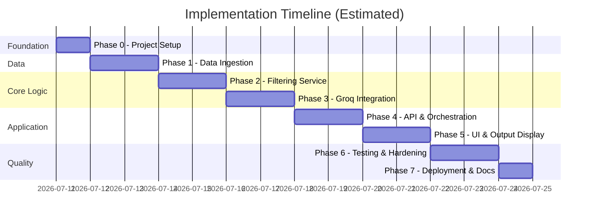
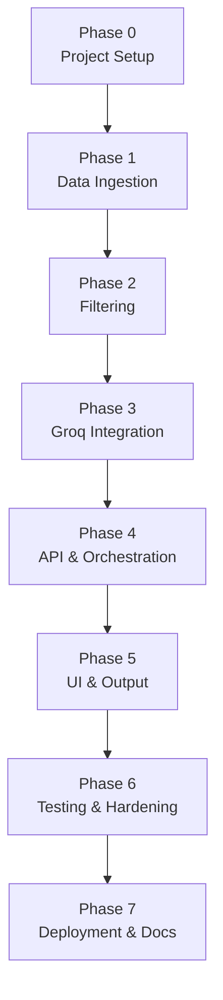

# Phase-Wise Implementation Plan

## AI-Powered Restaurant Recommendation System (Zomato Use Case)

This document defines a phased rollout plan derived from [context.md](./context.md) and [architecture.md](./architecture.md). Each phase builds on the previous one, delivering a testable increment toward the full retrieve-then-reason pipeline powered by **Groq**.

---

## Overview



**Total estimated duration:** 12–14 working days for a solo developer (MVP scope).

**Implementation strategy:** Bottom-up — data first, then deterministic filtering, then LLM reasoning, then API/UI, then polish.

---

## Phase Map

| Phase | Name | Maps To (context.md) | Primary Deliverable |
|-------|------|----------------------|---------------------|
| 0 | Project Setup | — | Runnable project skeleton |
| 1 | Data Ingestion | Stage 1 | Clean, cached restaurant dataset |
| 2 | Filtering Service | Stage 3 (partial) | Rule-based candidate shortlist |
| 3 | Groq Integration | Stages 3–4 | Ranked recommendations with explanations |
| 4 | Backend Engine & REST API | Stages 3–4 | FastAPI endpoints (`POST /recommendations`, `/metadata`), CORS, Groq LLM integration |
| 5 | High-Quality Frontend Web App | Stages 2 & 5 | Modern, responsive Zomato-themed web application with glassmorphism, animations, and telemetry |
| 6 | Testing & Hardening | All stages | Reliable edge-case handling |
| 7 | Deployment & Documentation | All stages | Deployable MVP + README |

---

## Phase 0: Project Setup & Foundation

**Goal:** Establish project structure, dependencies, and configuration so all later phases share a consistent foundation.

**Estimated effort:** 0.5–1 day

### Tasks

- [ ] Initialize Python project with proposed directory structure (see architecture §7)
- [ ] Create `requirements.txt` with pinned dependencies:
  - `fastapi`, `uvicorn`, `streamlit`
  - `datasets`, `pandas`, `pyarrow`
  - `pydantic`, `pydantic-settings`
  - `groq`, `python-dotenv`
  - `pytest`, `httpx` (for API tests)
- [ ] Add `.env.example` with all config vars from architecture §9
- [ ] Add `.gitignore` (`data/`, `.env`, `__pycache__/`, `.venv/`)
- [ ] Implement `app/config.py` using `pydantic-settings`:
  - Groq settings (`GROQ_API_KEY`, `GROQ_MODEL`, etc.)
  - Dataset settings (`HF_DATASET_NAME`, `DATASET_CACHE_PATH`)
  - Filtering thresholds (`MAX_CANDIDATES_FOR_LLM`, budget tiers)
- [ ] Define Pydantic models in `app/models/`:
  - `UserPreferences`
  - `Restaurant`
  - `Recommendation`, `RecommendationResponse`
- [ ] Add placeholder `GET /health` route in FastAPI

### Files to Create

```
app/__init__.py
app/config.py
app/main.py
app/models/preferences.py
app/models/restaurant.py
app/models/response.py
app/api/routes.py
app/api/dependencies.py
requirements.txt
.env.example
.gitignore
data/.gitkeep
```

### Acceptance Criteria

- `uvicorn app.main:app --reload` starts without errors
- Config loads from `.env` and fails clearly if `GROQ_API_KEY` is missing (when LLM is needed)
- Pydantic models validate sample inputs correctly

### Dependencies

- None

---

## Phase 1: Data Ingestion & Preprocessing

**Goal:** Load the Zomato dataset from Hugging Face, normalize it, and cache it for fast reuse.

**Maps to:** context.md — Stage 1 (Data Ingestion)

**Estimated effort:** 1.5–2 days

### Tasks

- [x] Implement `app/services/dataset_loader.py`:
  - Load [ManikaSaini/zomato-restaurant-recommendation](https://huggingface.co/datasets/ManikaSaini/zomato-restaurant-recommendation) via `datasets` library
  - Retry download up to 3× on failure
  - Save/load local parquet cache at `DATASET_CACHE_PATH`
- [x] Implement `app/services/preprocessor.py`:
  - Inspect raw schema and map columns to `Restaurant` model
  - Drop rows missing `name` or `location`
  - Normalize location strings (lowercase, strip whitespace)
  - Split comma-separated cuisine strings into `list[str]`
  - Parse `cost_for_two` and `rating` to typed values
  - Derive `budget_tier` from cost thresholds (calibrated: <=500 low, 501-1500 medium, >1500 high)
- [x] Build in-memory cache (pandas DataFrame or list of `Restaurant`)
- [x] Add `GET /api/v1/dataset/status` endpoint returning row count and cache status
- [x] Verify dataset statistics and distributions:
  - 12,519 deduplicated restaurants across 93 localities
  - Low: 9,095 | Medium: 3,138 | High: 286

### Files to Create

```
app/services/dataset_loader.py
app/services/preprocessor.py
tests/fixtures/sample_restaurants.json
tests/test_preprocessor.py
```

### Acceptance Criteria

- Dataset loads successfully from Hugging Face on first run
- Subsequent runs load from local parquet cache in < 100 ms
- Preprocessed output conforms to `Restaurant` schema
- `/dataset/status` returns accurate row count
- Unit tests pass for preprocessing edge cases (missing fields, multi-cuisine strings)

### Dependencies

- Phase 0 complete

### Notes

- Budget tier thresholds (`≤500`, `501–1500`, `>1500`) may need adjustment after inspecting actual cost distribution in the dataset.

---

## Phase 2: Filtering Service

**Goal:** Deterministically narrow the full dataset to a Groq-ready shortlist based on user preferences.

**Maps to:** context.md — Stage 3 (Integration Layer, filtering portion)

**Estimated effort:** 1.5–2 days

### Tasks

- [x] Implement `app/services/filtering.py` with ordered filter rules:
  1. Location (case-insensitive match)
  2. Cuisine (any-match against user's cuisine)
  3. Minimum rating (`rating >= min_rating`)
  4. Budget tier (map user tier to cost range)
  5. Optional keyword filter on free-text preferences
- [x] Cap shortlist at `MAX_CANDIDATES_FOR_LLM` (default: 30)
- [x] Pre-sort by rating × vote weight before capping
- [x] Implement filter relaxation fallback when results < 3:
  - Relax budget → cuisine → rating (configurable order)
- [x] Return metadata: filters applied, relaxation used, candidate count
- [x] Write unit tests with `tests/fixtures/sample_restaurants.json` and full dataset benchmark

### Files to Create

```
app/services/filtering.py
tests/test_filtering.py
```

### Acceptance Criteria

- Filtering completes in < 200 ms on full cached dataset
- Location + cuisine + rating + budget filters work independently and together
- Shortlist never exceeds configured cap
- Empty result set handled gracefully with metadata explaining why
- Relaxation fallback triggers correctly when matches are too few
- All unit tests pass

### Dependencies

- Phase 1 complete (preprocessed dataset available)

### Manual Test Example

```python
preferences = UserPreferences(
    location="Bangalore",
    budget="medium",
    cuisine="Italian",
    min_rating=4.0,
)
candidates = filtering_service.filter(preferences)
assert 0 < len(candidates) <= 30
```

---

## Phase 3: Groq Integration Layer

**Goal:** Connect filtering output to Groq for ranking, explanation, and optional summary generation.

**Maps to:** context.md — Stages 3–4 (Integration + Recommendation Engine)

**Estimated effort:** 2 days

### Tasks

- [x] Implement `app/services/prompt_builder.py`:
  - System instructions with anti-hallucination rules
  - Inject user preferences and candidate JSON/table
  - Request top-k ranked output in fixed JSON schema
- [x] Implement `app/services/groq_client.py`:
  - Initialize Groq client with config from `app/config.py`
  - Call `chat.completions.create` with `response_format={"type": "json_object"}`
  - Retry with exponential backoff on 429/5xx
  - Enforce timeout (`GROQ_TIMEOUT_SECONDS`)
- [x] Implement `app/services/response_parser.py`:
  - Extract JSON from response (handle markdown fences)
  - Validate against `RecommendationResponse` schema
  - Cross-check restaurant names against candidate list
  - Drop hallucinated entries
  - Enrich missing fields from dataset records
  - Fallback: retry with correction prompt, then template explanations
- [x] Create mock Groq client for tests (`tests/mocks/mock_groq_client.py`)
- [x] Write unit tests for prompt builder, response parser, and Groq client

### Files to Create

```
app/services/prompt_builder.py
app/services/groq_client.py
app/services/response_parser.py
tests/test_prompt_builder.py
tests/test_response_parser.py
tests/mocks/mock_groq_client.py
```

### Acceptance Criteria

- Prompt includes only necessary fields and explicit JSON output instructions
- Groq client returns valid JSON for a sample prompt (manual test with real API key)
- Response parser correctly handles:
  - Valid JSON
  - JSON wrapped in markdown code fences
  - Hallucinated restaurant names (dropped)
  - Missing optional fields (enriched from dataset)
- Retry logic works on simulated 429 response
- Unit tests pass without calling Groq API (mocked)

### Dependencies

- Phase 2 complete (filtered candidates available)
- Valid `GROQ_API_KEY` for manual integration testing

### Model Selection

| Environment | Model |
|-------------|-------|
| Development | `llama-3.1-8b-instant` |
| Production / demo | `llama-3.3-70b-versatile` |

---

## Phase 4: API & Orchestration

**Goal:** Wire all services into a single recommendation pipeline exposed via REST API.

**Maps to:** context.md — Stages 3–4 (full integration)

**Estimated effort:** 1.5–2 days

### Tasks

- [x] Implement `app/services/orchestrator.py`:
  - Ensure dataset is loaded
  - Run filter → prompt → Groq → parse pipeline
  - Return `RecommendationResponse` with metadata
  - Handle empty candidates without calling Groq
- [x] Implement `POST /api/v1/recommendations`:
  - Accept and validate `UserPreferences` body
  - Return 422 on validation errors with field details
  - Return 200 with recommendations or empty result + message
  - Return fallback on Groq unconfigured/failure after retries
- [x] Wire dependency injection in `app/api/dependencies.py`
- [x] Add structured logging (candidate count, latency, relaxation)
- [x] Write integration tests: dataset → filter → mock Groq → API response

### Files to Create / Update

```
app/services/orchestrator.py
app/api/routes.py          (update)
app/api/dependencies.py    (update)
tests/test_orchestrator.py
tests/test_api.py
```

### Acceptance Criteria

- `POST /api/v1/recommendations` returns ranked results for valid input
- End-to-end latency < 3 s (with cached dataset and Groq)
- Empty filter results return helpful message without Groq call
- Invalid input returns 422 with clear field errors
- Groq timeout/failure triggers fallback or 503 with user-friendly message
- Integration tests pass with mocked Groq client

### Sample API Request

```bash
curl -X POST http://localhost:8000/api/v1/recommendations \
  -H "Content-Type: application/json" \
  -d '{
    "location": "Delhi",
    "budget": "medium",
    "cuisine": "Chinese",
    "min_rating": 4.0,
    "additional_preferences": "family-friendly",
    "top_k": 5
  }'
```

### Dependencies

- Phases 1–3 complete

---

## Phase 5: High-Quality Frontend Web Application

**Goal:** Build a state-of-the-art, visually stunning, and responsive user-facing web interface that provides a premium dining discovery experience.

**Maps to:** context.md — Stages 2 (User Input) & 5 (Output Display)

**Estimated effort:** 2 days

### Visual & Technical Architecture
- **Aesthetic Direction:** Signature Zomato Crimson (`#E23744`) design system with dark-mode glassmorphism (`backdrop-filter: blur(16px)`), modern typography (Google Fonts *Outfit* for headings & *Inter* for body), subtle gradients, and reactive micro-interactions.
- **Frontend Core:** Pure modern HTML5 + Vanilla CSS3 + ES6 JavaScript (zero heavy framework overhead, instant load time, maximum design flexibility).
- **Hosting:** Served directly via FastAPI static files mounting at `/` with fallback, plus standalone dev mode.

### Key Features
1. **Hero & Connectivity Status:**
   - Dynamic header with pulsing live status indicator (Groq LLM active / Dataset loaded).
   - Instant quick-search pills for popular dining prompts (e.g., *"Bellandur 4.2+ Budget ₹1500"*, *"Koramangala Best Cafes"*).
2. **Interactive Filter Console:**
   - **Location**: Smart search input with datalist auto-complete + quick-select chips for top Bangalore hubs.
   - **Cuisine**: Multi-tag selection and search with popular cuisine chips.
   - **Budget**: Interactive tier segmented pills (Low $\le ₹500$, Medium $\le ₹1500$, High $> ₹1500$) with cost indicators.
   - **Rating**: Dynamic slider with live star feedback.
   - **Additional Preferences**: Keyword chips (*"Rooftop"*, *"Romantic"*, *"Family Friendly"*, *"Craft Beer"*, *"Late Night"*) + free-form text.
   - **Top-K**: 1 to 10 selector.
3. **Animated Recommendations Grid:**
   - Rank badges (`#1`, `#2`, etc.) with gold/crimson accents.
   - Star rating pill with review vote counter badge.
   - Price indicators and cuisine badges.
   - **Glowing AI Reasoning Box**: Highlighting the LLM's explanation of why each restaurant fits the user's specific preferences.
   - Telemetry breakdown: Latency in ms, Groq model utilized, candidates evaluated.
4. **UX States:**
   - Shimmer skeleton loaders during LLM inference.
   - Actionable empty state guidance when filters are too restrictive.
   - Toast error notifications on API issues.

### Files to Create / Maintain
```
frontend/index.html
frontend/styles.css
frontend/app.js
ui/streamlit_app.py        (retained for data-science exploration)
```

### Acceptance Criteria
- Visually stunning, responsive layout on desktop, tablet, and mobile screens.
- Seamlessly queries `POST /api/v1/recommendations` on FastAPI backend.
- Displays all required output fields (Name, Cuisine, Rating, Cost, AI Explanation).
- Loading states with skeleton animations and clear error handling.

### Run Commands

```bash
# Terminal 1 — API
uvicorn app.main:app --reload --port 8000

# Terminal 2 — UI
streamlit run ui/streamlit_app.py
```

### Dependencies

- Phase 4 complete (API endpoint working)

---

## Phase 6: Testing & Hardening

**Goal:** Improve reliability, cover edge cases, and validate the full system against architecture requirements.

**Maps to:** All stages — quality gate before deployment

**Estimated effort:** 1.5–2 days

### Tasks

- [x] Complete test suite:

  | Test File | Coverage |
  |-----------|----------|
  | `test_preprocessor.py` | Schema normalization, missing data |
  | `test_filtering.py` | All filter rules, cap, relaxation |
  | `test_prompt_builder.py` | Prompt structure, variable injection |
  | `test_response_parser.py` | JSON extraction, hallucination drop, fallback |
  | `test_orchestrator.py` | Full pipeline with mock Groq |
  | `test_api.py` | HTTP status codes, validation, error envelopes |
  | `test_ui_smoke.py` | Streamlit app imports, dual-mode fallback, card formatters |
  | `test_edge_cases.py` | 5-scenario E2E matrix, unicode, boundaries, contract compliance |

- [x] Implement all error scenarios from architecture §10:

  | Scenario | Implementation |
  |----------|----------------|
  | Dataset download fails | 3× retry + clear error message |
  | No restaurants match | Empty response + suggestions |
  | Too few matches | Filter relaxation |
  | Groq timeout | Retry + fallback |
  | Groq rate limit (429) | Backoff + user message |
  | Invalid JSON from Groq | Correction retry + template fallback |
  | Hallucinated restaurant | Parser drops invalid entries |

- [x] Add contract test: verify Groq output schema against Pydantic model
- [x] Run automated E2E test with 5+ diverse preference combinations
- [x] Tune budget thresholds and `MAX_CANDIDATES_FOR_LLM` based on real results
- [x] Review prompt quality — iterate if explanations are generic or repetitive

### Acceptance Criteria

- `pytest` passes with 74/74 passing tests across entire codebase
- All edge cases from architecture §10 have defined behavior
- Automated E2E scenarios produce sensible recommendations
- No hallucinated restaurants appear in final output
- Groq failures degrade gracefully (never a blank screen)

### Dependencies

- Phases 0–5 complete

---

## Phase 7: Deployment & Documentation

**Goal:** Package the MVP for demo/deployment and document setup and usage.

**Estimated effort:** 1 day

### Tasks

- [x] Write `README.md`:
  - Project overview and architecture summary with Mermaid diagram
  - Prerequisites (Python 3.11+, Groq API key)
  - Setup instructions (`pip install`, `.env` configuration)
  - How to run API + Streamlit UI
  - Example API request/response with curl commands
  - Link to dataset source
- [x] Finalize `.env.example` with comments for each variable
- [x] Add `Dockerfile` for containerized deployment
- [x] Verify fresh clone → setup → run works on a clean environment
- [x] Record demo scenarios for presentation:
  - Indiranagar + Italian + medium budget
  - Koramangala + Burger + medium budget
  - Whitefield + North Indian + low budget
  - Edge case: very restrictive filters → empty/relaxed results

### Acceptance Criteria

- README allows a new developer to run the app in < 15 minutes
- `.env.example` documents all required variables
- App runs end-to-end on a clean machine with only documented steps
- Demo scenarios produce presentable output

### Dependencies

- Phase 6 complete

---

## Milestone Checklist

Use this to track overall progress:

```
[x] M0 — Project runs locally with config and models defined
[x] M1 — Dataset loaded, preprocessed, and cached
[x] M2 — Filters return correct shortlist for sample preferences
[x] M3 — Groq returns ranked JSON recommendations for a shortlist
[x] M4 — API endpoint returns full RecommendationResponse
[x] M5 — Streamlit UI displays recommendations end-to-end
[x] M6 — Tests pass; edge cases handled
[x] M7 — README complete; MVP demo-ready
```

---

## Phase Dependency Graph



---

## Risk Register

| Risk | Phase | Impact | Mitigation |
|------|-------|--------|------------|
| Dataset schema differs from expected | 1 | High | Inspect raw data first; make column mapping configurable |
| Budget thresholds don't match data distribution | 1, 2 | Medium | Calibrate thresholds during Phase 1 exploration |
| Groq returns invalid JSON | 3 | Medium | `response_format`, correction retry, template fallback |
| Groq rate limits during demo | 3, 6 | Medium | Use 8B model for dev; cache results; backoff handling |
| LLM hallucinates restaurants | 3 | High | Parser cross-checks names against candidate list |
| Too many/few candidates after filtering | 2 | Medium | Tune cap and relaxation rules in Phase 6 |
| Streamlit + FastAPI port conflicts | 5 | Low | Document ports; use env vars for API URL |

---

## Definition of Done (MVP)

The MVP is complete when all of the following are true:

1. User can enter location, budget, cuisine, minimum rating, and optional preferences via Streamlit
2. System loads and caches the Hugging Face Zomato dataset
3. Filtering narrows candidates before any Groq call
4. Groq ranks and explains recommendations grounded in filtered data
5. UI displays name, cuisine, rating, cost, and AI explanation for each pick
6. Edge cases (no matches, Groq failure, bad JSON) are handled gracefully
7. README documents setup and usage
8. Core services have automated tests with mocked Groq

---

## Post-MVP Backlog

Items explicitly out of MVP scope (from architecture §15) to tackle after Phase 7:

| Priority | Enhancement |
|----------|-------------|
| P1 | Conversational refinement (multi-turn chat) |
| P1 | Location/cuisine autocomplete from live dataset |
| P2 | Semantic search with embeddings |
| P2 | Query result caching (Redis or in-memory TTL) |
| P3 | User profiles and recommendation history |
| P3 | Observability (Langfuse / OpenTelemetry) |
| P3 | A/B testing Groq models and prompt variants |

---

## Quick Reference: Phase → Files

| Phase | Key Files |
|-------|-----------|
| 0 | `config.py`, `models/*`, `requirements.txt`, `.env.example` |
| 1 | `dataset_loader.py`, `preprocessor.py` |
| 2 | `filtering.py` |
| 3 | `prompt_builder.py`, `groq_client.py`, `response_parser.py` |
| 4 | `orchestrator.py`, `api/routes.py` |
| 5 | `ui/streamlit_app.py` |
| 6 | `tests/*` |
| 7 | `README.md`, `Dockerfile` (optional) |
